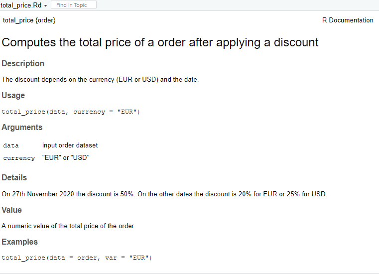
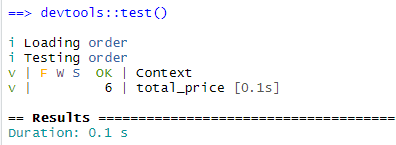

```{r setup, include=FALSE}
knitr::opts_chunk$set(echo = TRUE)
```

## Introduction

This document covers the coding practices used to solve the problem presented, the writing of unit tests, and data creation for the package:


This project is available at: https://github.com/raphaelDuff/order/

```{r, echo=FALSE,out.width='75%', fig.align='center'}

```

## Coding Exercise

**Challenge:** Somebody wrote a function *total_price()*. It takes the order *dataframe* and *currency* as arguments. Returned value is the sum of all products' prices from the given order, after applying a discount. Discount depends on the currency (for EUR it is 20%, for USD - 25%) and the date (on 27th November 2020 the store has a 50% discount!). Unfortunately, the written function is badly coded. Please refactor it!

Function ***total_price()***:

```
total_price <- function(order, currency = "EUR") {
  discount <- ifelse(currency == "EUR", 0.2, 0.25)
  discount <- ifelse(Sys.Date() == as.Date("2020-11-27"), 0.5, discount)
  total <- (order %>% dplyr::select(paste0(“price_”, currency)) * (1 - discount)) %>% sum
  return(total)
}
```

## Coding Exercise - Solution

In order to test the function ***total_price***, the project was created using *devtools* helping the construction of a safe environment to develop function documentation, unit tests and to define the required packages for the project.

### Writing documentation for total_price

To an easier code reuse, the function was commented to explain its usage, the input parameters and the expected output:
```
#' Computes the total price of a order after applying a discount
#'
#' The discount depends on the currency (EUR or USD) and the date.
#'
#' On 27th November 2020 the discount is 50%.
#' On the other dates the discount is 20% for EUR or 25% for USD.
#'
#' @param data input order dataset
#' @param currency "EUR" or "USD"
#'
#' @return A numeric value of the total price of the order
#' @export
#'
#' @examples
#' total_price(data = order, var = "EUR")
#'
#' @importFrom rlang .data
total_price <- function(data, currency = "EUR"){

  # alert user if currency parameter is not EUR or USD ----
  if (!(currency %in% c("EUR", "USD"))){
    usethis::ui_stop("{currency} is not a valid currency. It must be EUR or
                     USD!")
  }

  # alert user if there is any NA in the dataset ----
  if (sum(is.na(data) != 0) ){
    usethis::ui_stop("NA value(s) found at dataset. Please check!")
  }

  # alert user if there any of the variables product, price_EUR or price_USD is
  # missing ----
  if (!all("product" %in%  colnames(data),
          "price_EUR" %in%  colnames(data),
          "price_USD" %in%  colnames(data))){
    usethis::ui_stop("One or more required columns are missing from dataset")
  }

  discount_date <- "2020-11-27"

  discount <- ifelse(currency == "EUR", 0.2, 0.25)
  discount <- ifelse(Sys.Date() == as.Date(discount_date), 0.5, discount)
  order_currency_column <- data %>% dplyr::select(paste0("price_", currency))
  total <- sum(order_currency_column) * (1 - discount)
  return(total)
}
```
After the documentation ***total_price.Rd*** of the function was created by ***roxygen2*** command, as it follows:
```
roxygen2::roxygenise()
```
Now the command ***help*** could be used to see the function documentation:
```
help(total_price)
```
```{r, echo=FALSE,out.width='50%', fig.align='center'}

```

### Code Refactoring

To ensure that the code is functioning as expected, at this stage some validators were added in the beginning of the function:

**Currency parameter verification:** here the code stops if the parameter is not "EUR" or "USD".
```
  # alert user if currency parameter is not EUR or USD ----
  if (!(currency %in% c("EUR", "USD"))){
    usethis::ui_stop("{currency} is not a valid currency. It must be EUR or USD!")
  }
```
**NA verification:** here the code stops if the dataset provided contains any *NA* value.
```
  # alert user if there is any NA in the dataset ----
  if (sum(is.na(data) != 0) ){
    usethis::ui_stop("NA value(s) found at dataset. Please check!")
  }
```

**Check if the three variable are in data:** here the code stops if any of the variables *product*, *price_EUR* or *price_USD* is missing.
```
  # alert user if there any of the variables product, price_EUR or price_USD is
  # missing ----
  if (!all("product" %in%  colnames(data),
          "price_EUR" %in%  colnames(data),
          "price_USD" %in%  colnames(data))){
    usethis::ui_stop("One or more required columns are missing from dataset")
  }
```

To finish the variable ***discount_date*** was created to make it easier to identify this value for the case of a future replacement for a new date value, and the pipe %>% was splited to respect the number of max characters per line and to facilitate the reading.

### Unit tests

The test file ***test-total_price.R*** was created using the follow ***testthat*** command:
```
use_testthat()
```
With ***test-total_price.R*** created, the tests were added: 
```
test_that("total_price returns a coherent value for EUR", {
  expected_EUR <- total_price(data = orderData, currency = "EUR")
  expect_equal(expected_EUR, 1036.8)
})

test_that("total_price returns a coherent value for USD", {
  expected_USD <- total_price(data = orderData, currency = "USD")
  expect_equal(expected_USD, 1111.5)
})

test_that("total_price returns a double type value", {
  expected <- total_price(data = orderData)
  expect_type(expected, "double")
})

test_that("total_price test if the currency paramter is a expected value", {
  expect_error(total_price(data = orderData, currency = "BRL"))
})

test_that("NA value(s) detected in the dataset", {
  expect_error(total_price(data = orderNaData, currency = "USD"))
})

test_that("Column missing to calculate", {
  expect_error(total_price(data = orderMissingColumnData, currency = "USD"))
})
```
The data used to test was created using the recommendations https://r-pkgs.org/data.html#data-data described at the book "R Packages" by Hadley Wickham.

**orderMockupData.R**:

```
#' Script used to create data to test the function total_price
#' Output: Three datasets are created:
#' 1) a regular dataset
#' 2) a dataset containing one NA value
#' 3) a dataset missing the column price_EUR

product <- c("smartwatch", "laptop", "monitor", "headphones", "printer")
price_EUR <- c(217, 517, 279, 173, 110)
price_USD <- c(249, 591, 319, 198, 125)
orderData <- data.frame(product, price_EUR, price_USD)
price_EUR <- c(217, 517, 279, 173, NA)
orderNaData <- data.frame(product, price_EUR, price_USD)
orderMissingColumnData <- data.frame(product, price_USD)
usethis::use_data(orderData, overwrite = TRUE)
usethis::use_data(orderNaData, overwrite = TRUE)
usethis::use_data(orderMissingColumnData, overwrite = TRUE)
```

With the data available, the first two tests were created to validate if the returned value for both currencies is according to what was expected.
The third test is used to ensure that the total price returned is a double type of value.
The last three tests are validating the *ui_stop* verifications added in the function *total_price.R*.

So shall we test:
```{r, echo=FALSE,out.width='50%', fig.align='center'}

```

***Thank you for this opportunity and it will be awesome if we could work together!***
